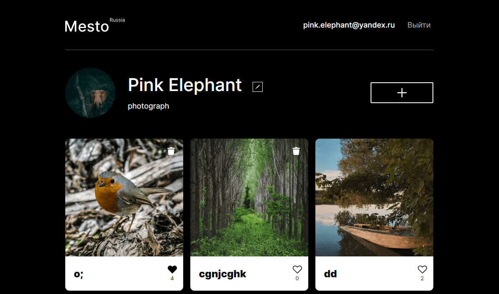

***
# react-mesto-api-full

Репозиторий для приложения проекта `Mesto`, включающий фронтенд и бэкенд части приложения со следующими возможностями:
> бэкенд в директории `backend/`
>
> фронтенд - в `frontend/`
## frontend 
- Файловая структура по БЭМ (Nested)
- Обнуление стилей при помощи normalize.css
- Подключены шрифты через @font-face
- Использованы css-переменные
- Использованы Flex и Grid для построения сеток и выравнивания
- Использованы @media для адаптации под разные разрешения экрана
- Вёрстка из Фигмы
- Функционал на Реакте (CRA)
- Запросы к API, аутентификация пользователя, защищённые роуты, хуки, контекст

## backend
- настройка инфраструктуры проекта (editorconfig, линтер, etc.)
- база данных на MongoDB
- разворачивание бэкенда на удалённой машине (pm2, nginx)
- обработка ошибок
- проверка токенов
- регистрация и авторизация пользователей
- изменение профиля
- сохранение карточки
- лайк/дизлайк

ссылка на сайт, размещенный на Яндекс.Облаке: https://mesto.olgalatkina.nomoredomains.sbs/

